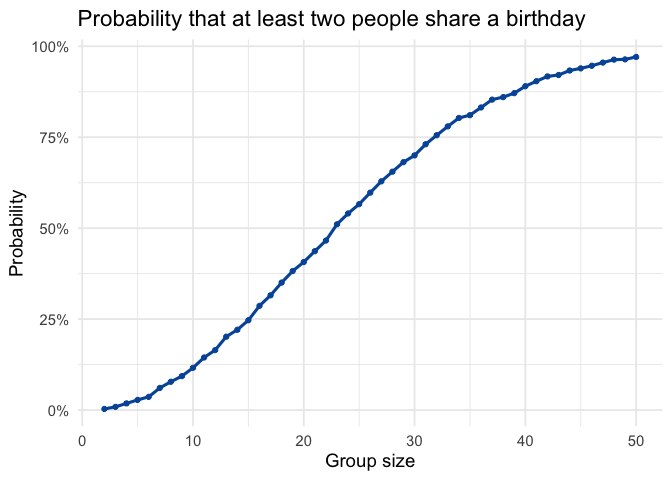
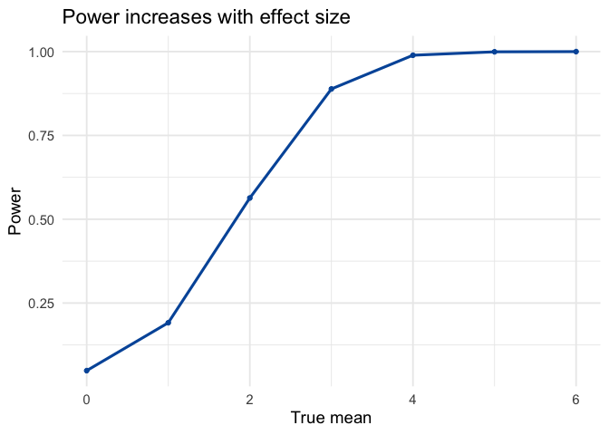

p8105-hw5-yw4662
================

## Problem 1

``` r
# Function to check if a group shares a birthday
has_duplicate_bday <- function(n_people) {
  bdays <- sample(1:365, size = n_people, replace = TRUE)
  any(duplicated(bdays))
}

# Repeat the experiment many times
simulate_bdays <- function(n_people, n_sim = 10000) {
  mean(replicate(n_sim, has_duplicate_bday(n_people)))
}

# Apply to group sizes 2-50
results_bday <- tibble(
  n = 2:50,
  prob_shared = map_dbl(n, simulate_bdays)
)

# Plot
results_bday %>%
  ggplot(aes(n, prob_shared)) + 
  geom_line(linewidth = 1.1, color = "#0057A8") + 
  geom_point(color = "#0057A8") + 
  scale_y_continuous(labels = scales::percent) + 
  labs(
    title = "Probability that at least two people share a birthday",
    x = "Group size",
    y = "Probability"
  )
```

<!-- -->

### Interpretation

The plot shows how the probability of at least two people sharing a
birthday increases as group size grows. For very small groups (fewer
than 10 people), the probability is low, meaning that shared birthdays
are rare. However, the curve rises quickly and non-linearly. Around
22-23 people, the probability crosses 50%, meaning that once a room has
more than 23 people, a shared birthday is more likely than not. By 50
people, it is over 95%.

Overall, the plot illustrates how counterintuitive the birthday problem
is: even moderate-sized groups have a surprisingly high chance of
sharing a birthday, despite there being 365 possible days.

## Problem 2

``` r
# Simulation for one value of mu
sim_one_mu <- function(mu, n = 30, sigma = 5, n_sim = 5000) {
  results <- replicate(n_sim, {
    x <- rnorm(n, mean = mu, sd = sigma)
    tidy(t.test(x, mu = 0)) %>%
      select(estimate, p.value)
  }, simplify = FALSE)
  bind_rows(results)
}

# Run for mu = 0:6
mus <- 0:6
sim_df <- tibble(mu = mus) %>%
  mutate(res = map(mu, sim_one_mu)) %>%
  unnest(res)

# Compute power and mean estimates
power_df <- sim_df %>%
  group_by(mu) %>%
  summarise(
    power = mean(p.value < 0.05),
    mean_est_all = mean(estimate),
    mean_est_sig = mean(estimate[p.value < 0.05]),
    .groups = "drop"
  )

# Power vs mu
power_df %>%
  ggplot(aes(mu, power)) + 
  geom_line(color = "#0057A8", linewidth = 1.1) + 
  geom_point(color = "#0057A8") + 
  labs(
    title = "Power increases with effect size",
    x = "True mean",
    y = "Power"
  )
```

<!-- -->

``` r
# Mean estimates
power_df %>%
  pivot_longer(c(mean_est_all, mean_est_sig),
               names_to = "type", values_to = "mean_est") %>%
  mutate(type = recode(type,
                       mean_est_all = "All samples", 
                       mean_est_sig = "Samples where null rejected")) %>%
  ggplot(aes(mu, mean_est, color = type)) +
  geom_line(linewidth = 1.1) + 
  geom_point() + 
  labs(
    title = "Average estimate vs true mean", 
    x = "True mean", 
    y = "Average of sample means",
    color = NULL  
    )
```

<!-- -->

### Comment

From the plot, **the sample average of $\mu$ among samples where the
null was rejected is not equal to the true $\mu$**, especially for
smaller effect sizes. For smaller true means, the teal line lies above
the red line and above the actual $\mu$, indicating positive bias among
the subset of samples that produced a significant result.

This happens because conditioning on rejection introduces selection
bias. When $\mu$ is small, only samples with unusually large sample
means (far above the true $\mu$) produce a p-value below 0.05. These
overestimates are exactly the samples that get selected into the
rejected group. As a result, the average $\hat\mu$ among rejected
samples is systematically inflated.

As $\mu$ becomes large, power approaches 1, meaning nearly all samples
reject the null. Because we are no longer selecting only extreme
samples, the teal line converges toward the red line, and both approach
the true $\mu$.
